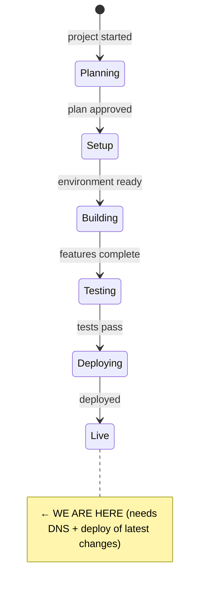

# State

> Last updated: 2026-03-03 (evening)

## System State Diagram

## Component Status

| Component | Status | Notes |
|-----------|--------|-------|
| Project template | ✅ Done | claude-code-template initialised |
| Backend API | ✅ Done | Express + SQLite, running on VPS port 3001 |
| Auth middleware | ✅ Done | Bearer token (API) + Caddy basic auth (site) |
| Database | ✅ Done | SQLite with tasks, sessions, settings tables |
| Sync API | ✅ Done | GET/POST with last-write-wins conflict resolution |
| Clock visualisation | ✅ Done | SVG clock face with task arcs, calendar events, meeting buffer arcs, flexible breaks |
| Pomodoro timer | ✅ Done | 25/5/15 cycles, notifications, audio |
| Task management | ✅ Done | CRUD, reorder, fixed-time, reschedule, batch move to tomorrow, unfinished tasks prompt, colour-matched task list borders |
| Accessibility audit | ✅ Done | All critical/high issues fixed (8 items); 35 medium/low items remain |
| Task scheduling | ✅ Done | Auto-advance, fixed-time slots, gap filling, calendar buffer, flexible breaks scheduled into gaps |
| iCal integration | ✅ Done | Fetch + parse iCal feeds, display on clock, configurable buffer |
| Help modal | ✅ Done | "How to use" with FAQ accordion, accessible via ? button |
| PWA config | ✅ Done | Service worker, manifest, icons |
| Caddy config | ✅ Done | Reverse proxy + basic_auth for chronotasker.dougbelshaw.com |
| DNS setup | ⏳ Pending | Needs A record: chronotasker.dougbelshaw.com -> 80.78.23.57 |
| Device testing | ⏳ Pending | Android, Mac, Linux browsers |
| Git history | ⏳ Pending | No commits yet; all files untracked |

## Dependencies

| Dependency | Status | Notes |
|------------|--------|-------|
| VPS (80.78.23.57) | ✅ Working | Debian, Node 20, Caddy in Docker |
| pm2 | ✅ Running | Process "chronotasker", auto-restart on boot |
| Caddy | ✅ Configured | Site block with basic_auth, awaiting DNS |
| DNS | ⚠️ Needs setup | A record for chronotasker.dougbelshaw.com |
